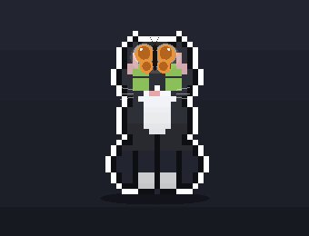
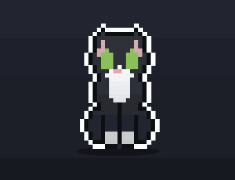
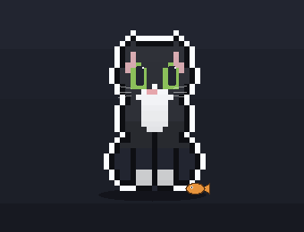

<div align="center">


# pixelpets

### A pixel cat or dog that lives on your desktop.

It sits in the corner, watches your cursor, kneads the keyboard when you type,
purrs when you pet it, and stretches like mochi when you drag it. Prefer a dog?
Switch species from the tray for a Black Lab that play-bows, pants, and fetches a
tennis ball. Nearly every sprite and animation is generated in code, and the sound
is synthesized live: there are no audio files at all.

<br />

[](https://github.com/JOhnsonKC201/pixelpets/stargazers)
&nbsp;[](https://github.com/JOhnsonKC201/pixelpets/actions/workflows/ci.yml)
&nbsp;[](https://github.com/JOhnsonKC201/pixelpets/releases/latest)
&nbsp;-4C566A?style=flat-square&labelColor=15161d)
&nbsp;[](LICENSE)

<br />


<sub>Every frame is rendered from the same sprite the app draws with, not screen-captured. <a href="assets/hero-banner.mp4">MP4 version</a>.<br />
The cat shown here is the <b>Tuxedo</b> coat; a new install opens on Mackerel Tabby, and right-clicking your pet cycles all 14.</sub>

<br />

[](https://github.com/JOhnsonKC201/pixelpets/releases/latest)
&nbsp;
[](https://pixelcat-jet.vercel.app)

<sub>The browser demo runs the real renderer: pet it, type at it, scroll to see it react, and wait for the butterfly.</sub>

<br />

<sub>
  <a href="#install">Install</a>&nbsp;·
    <a href="#see-it-in-action">In action</a>&nbsp;·
    <a href="#what-it-does">What it does</a>&nbsp;·
    <a href="#controls">Controls</a>&nbsp;·
    <a href="#ai-agent-reactions">AI agents</a>&nbsp;·
    <a href="#privacy">Privacy</a>&nbsp;·
    <a href="#documentation">Docs</a>
</sub>

</div>

---

## Install

| | |
|---|---|
| **Windows** | 10 or 11. Download the installer below. |
| **macOS** | 12 or newer, **beta**: the port is code-complete and the builds are ad-hoc signed, but nobody has run one on real Apple hardware yet. |
| **Linux** | Not supported. Electron would run, but the overlay and the global input hooks are Windows/macOS only. |
| **From source** | Any of the above, plus git and Node 20 or newer. |

[](https://github.com/JOhnsonKC201/pixelpets/releases/latest)

Or run it from source, on any supported platform:

```bash
git clone https://github.com/JOhnsonKC201/pixelpets.git
cd pixelpets
npm install
npm start
```

Either way your pet appears in the corner and registers itself to start at login.
`npm run autostart:off` turns that off, and the installed version uninstalls from
Windows Settings > Apps like any other program.

<details>
<summary><b>Your OS will warn you the first time, and that is expected.</b></summary>

<br />

The builds are not code-signed, because a certificate costs real money for a free
app.

- **Windows:** SmartScreen shows a blue *"Windows protected your PC"* screen.
  Click **More info**, then **Run anyway**.
- **macOS:** Gatekeeper refuses a double-click. Try to open it once, then go to
  **System Settings > Privacy & Security** and click **Open Anyway**. (On macOS 14
  and earlier, right-clicking the app and choosing **Open** also works; macOS 15
  removed that shortcut.)

Would rather not? The [browser demo](https://pixelcat-jet.vercel.app) is the real
renderer with nothing to install, and running from source skips the installer
entirely.

What the app does on your machine is documented in [Privacy](#privacy) and
[SECURITY.md](SECURITY.md): the keyboard hook forwards a single "a key was
pressed" boolean and never what you typed.

</details>

Running from source has two platform notes, a silent Windows launcher and the
macOS Accessibility grant, both covered in the
[development guide](docs/development.md).

## See it in action

<table align="center">
<tr>
<td align="center"><br /><sub><b>Reacts when you scroll</b></sub></td>
<td align="center"><br /><sub><b>Plays with a butterfly</b></sub></td>
<td align="center"><br /><sub><b>Stretches like mochi</b></sub></td>
</tr>
<tr>
<td align="center"><br /><sub><b>Noms a treat</b></sub></td>
<td align="center"><br /><sub><b>Sings and meows</b></sub></td>
<td align="center"><br /><sub><b>Pounces on the cursor</b></sub></td>
</tr>
</table>

<div align="center">
<sub>Typing and petting are in the banner above. Every pose is composed into the pet's own sprite,
so all 15 coats and both species get every one of them in their own colours, without shipping a
single extra image.</sub>
</div>

## What it does

|  |  |
|---|---|
| **It reacts to you** | Petting, dragging, typing, scrolling, and cursor play each get their own response, gated by an internal mood model that runs from calm up to zoomies and back. |
| **15 coats, one shape** | 14 cat coats and a Black Lab, all recolored at draw time from one role-coded sprite. Design, import, and export your own. |
| **No spare frames** | Every animation is composed into that sprite, limbs included, so every coat and both species get every pose in their own colours. |
| **Zero audio files** | The meow, the bark, the purr, the pant, and an endlessly improvising lo-fi jam are all synthesized live with Web Audio. |
| **It keeps you on track** | Break and Pomodoro timers, repeating reminders, a pinned note, IMAP unread-mail alerts, and calendar nudges, all delivered by your pet. |
| **It knows when to shut up** | Focus Guard reads "busy" from a live calendar event, Quiet Hours, or Work mode, parks the pet, and holds messages back rather than meowing into your screen-share. Nothing is dropped; you get one summary line when you are free. |
| **It watches your agent** | It knows when your coding agent is thinking, working, or done, and reacts with its paws. Hook configs ship for five agents. |
| **It stays out of the way** | A transparent, click-through overlay that sits above every window. Only your pet is clickable. |

<div align="center">


<sub><b>Fourteen cat coats, one shape.</b> Every pose in every coat, recolored from a single role-coded sprite at draw time.<br />
Prefer to watch them cycle? <a href="assets/coat-carousel.gif">Here they are, one at a time</a>.</sub>

</div>

### Cat or dog

Pick your species from the tray (**Pet > Cat / Dog**); each keeps its own coat.
The dog is not a recoloured cat: it has its own sprite module, a muzzle that
protrudes past the skull line, floppy ears, a broader chest, and a straight otter
tail. Where the cat does a hunting crouch it does a play bow, where the cat grooms
it pants, and where the cat gets a fish it gets a tennis ball it will actually
chase down and bring back.

[The full comparison, and every interaction, is in the feature guide.](docs/features.md#cat-or-dog)

## Controls

| Action | What it does |
|--------|--------------|
| **Drag** your pet (hold left) | Stretches it like mochi; it settles onto the bottom line where you release, and that spot becomes its new home |
| **Right-click** it | Cycles to the next coat |
| **Tap** it | A quick pet: happy eyes, hearts, a chirp |
| **Rest cursor on its head** | Happy eyes, floating hearts, and a purr |
| **Rest cursor on its body** | Leans and arches into your hand, tail up, trilling |
| **Type** (any app) | Front-paw kneading; fast typing overheats it |
| **Scroll** (any app) | Rears up and swipes at a blowing leaf, or climbs a yarn rope on the four coats that ship painted climb art |
| **Double-click** it | Opens Settings (name, timers, reminders, coat) |
| **Tray icon** | Settings, Start break now, coat picker, play area, sound and hunt and mood toggles, Quit |

Settings persist to `settings.json` in your per-user app-data folder
(`%APPDATA%/pixelpets/` on Windows, `~/Library/Application Support/pixelpets/` on
macOS). An install that predates the rename is migrated across on first launch.
Timers and reminders only fire while pixelpets is running, and reminder times use
your local clock.

## AI agent reactions

Your pet reacts to a coding agent's work status, and it uses its paws to do it. It
raises a paw to its chin to ponder while an agent like Claude Code, Codex, or
Cursor thinks, taps a paw along with a spinner while it works, and does a happy
hop and meow when it finishes. Any tool can signal it by running the bundled
helper, which writes a tiny status file the pet watches
(`%TEMP%/pixelcat-agent.state`):

```bash
node agent-hook.js thinking   # ponders, paw to chin + "…" bubble
node agent-hook.js editing    # taps a paw + "working" spinner
node agent-hook.js error      # startles (flinch)
node agent-hook.js done       # happy hop + meow
node agent-hook.js idle       # back to normal
```

Ready-to-use configs for **Claude Code, Codex CLI, Cursor, Antigravity and Kiro**
live in [`integrations/`](integrations/), and `npm run hook -- <agent>` prints
yours with the absolute path already filled in. The helper is hook-safe: it
drains stdin and replies `{"continue": true}`, so it never blocks or alters your
agent.

<sub>The richer status reactions were inspired by the open-source AI desktop pets
<a href="https://github.com/alvinunreal/openpets">openpets</a> (MIT) and
<a href="https://github.com/rullerzhou-afk/clawd-on-desk">clawd-on-desk</a> (AGPL-3.0).
Ideas only; all code here is original to pixelpets.</sub>

## Privacy

Your pet reacts to your typing and scrolling, which means it listens to global
input events, so here is the plain statement: input is used only to trigger
animations, in the moment, on your machine. Keystrokes are never logged, stored,
or sent anywhere. There is no telemetry and no auto-update. The app makes no
network connections at all unless you set up the optional mail or calendar
alerts, and those talk only to the servers you point them at, from isolated
worker processes. Your IMAP app password is stored encrypted at rest (Electron
`safeStorage`) and never written to `settings.json`.

## Documentation

| Guide | What is in it |
|---|---|
| [Features](docs/features.md) | Every interaction, coat, mood, sound, and productivity feature |
| [Custom coats](docs/custom-coats.md) | Designing, hand-editing, and sharing your own coat |
| [How it works](docs/architecture.md) | One sprite covering 15 coats, and the project layout |
| [Development](docs/development.md) | Running from source, building installers, visual QA |
| [Frame pack](docs/frame-pack.md) | Painting a pose by hand and importing it |
| [Agent hooks](integrations/) | Wiring the pet to Claude Code, Codex, Cursor, Antigravity, Kiro |
| [iPad terminal](tools/ipad-terminal/) | A real terminal for *this* machine, driven from an iPad |

## Development

```bash
npm start          # run the app
npm test           # the full suite: no Electron and no GPU required
npm run lint       # what CI runs, alongside the tests and a real boot check
npm run poses:cat  # contact sheet: every activity x every coat, for visual QA
npm run demo:all   # regenerate the README's hero, gallery, and coat carousel
```

The overlay is GPU-composited, so ordinary screenshots cannot capture it. Visual
changes are reviewed with those contact sheets instead. The full command list,
build instructions, and the macOS beta checklist are in the
[development guide](docs/development.md).

## Contributing

Bug reports, ideas, and PRs are all welcome. Start with the
[contributing guide](CONTRIBUTING.md); the [security policy](SECURITY.md) covers
reporting a vulnerability privately.

If you own a Mac, running the
[beta checklist](docs/development.md#macos-beta-checklist) and opening an issue
with whatever you see is the single most useful contribution right now.

Custom coats and desk setups belong in
[Discussions](https://github.com/JOhnsonKC201/pixelpets/discussions), and release
history lives in the [changelog](CHANGELOG.md).

---

<div align="center">

Made for fun. All art, code, and sound are original; the meow and purr are
synthesized in code, with no audio files. pixelpets is inspired by, not copied
from, Comnyang: no Comnyang assets, sprites, audio, or branding are used.

[**MIT**](LICENSE) © [JOhnsonKC201](https://github.com/JOhnsonKC201)

</div>
