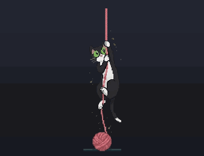
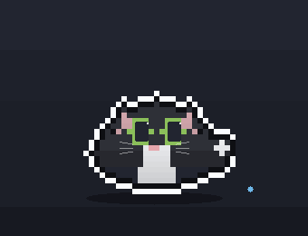
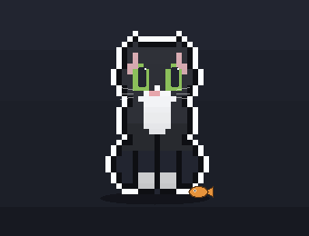

<div align="center">


# pixelpets

A pixel cat (or dog) that lives on your desktop.

[](https://github.com/JOhnsonKC201/pixelpets/actions/workflows/ci.yml)
&nbsp;[](https://github.com/JOhnsonKC201/pixelpets/releases/latest)
&nbsp;[](LICENSE)


**[Download for Windows](https://github.com/JOhnsonKC201/pixelpets/releases/latest)** &nbsp;·&nbsp; [macOS beta](https://github.com/JOhnsonKC201/pixelpets/releases/latest) &nbsp;·&nbsp; [Try it in your browser](https://pixelcat-jet.vercel.app)

</div>

It sits in the corner of your screen and keeps you company. It watches your cursor, kneads the keyboard while you type, purrs when you pet it, and stretches like mochi if you drag it around. If you'd rather have a dog, there's a Black Lab that play-bows, pants and fetches a tennis ball.

It's free, there are no ads and no account, and it doesn't send anything anywhere. Not sure yet? The [browser demo](https://pixelcat-jet.vercel.app) is the same pet with nothing to install.

## Get it

**Windows 10 or 11.** Download the installer from the [latest release](https://github.com/JOhnsonKC201/pixelpets/releases/latest) and run it. It uninstalls from Settings > Apps like anything else.

**macOS 12 or newer.** The same page has builds for Apple Silicon and Intel. Treat these as a beta: the port is finished, but I haven't been able to run it on a real Mac yet. If you try it, [tell me what happened](https://github.com/JOhnsonKC201/pixelpets/issues), good or bad.

The pet starts when you log in. To stop that, switch it off under Settings > Apps > Startup on Windows, or System Settings > General > Login Items on a Mac.

<details>
<summary>Your computer will warn you the first time. Here's why, and what to click.</summary>

<br />

The installers aren't code-signed. A signing certificate costs money every year and this is a free side project, so Windows and macOS don't recognise the publisher.

- **Windows** shows a blue "Windows protected your PC" screen. Click **More info**, then **Run anyway**.
- **macOS** won't open it on a double-click. Try once, then go to System Settings > Privacy & Security and click **Open Anyway**.

If that makes you uneasy, that's reasonable. The browser demo needs no install, and [Is it safe?](#is-it-safe) below says exactly what the app does on your machine.

</details>

## What it does

<table align="center">
<tr>
<td align="center"><br /><sub>typing</sub></td>
<td align="center"><br /><sub>petting</sub></td>
<td align="center"><br /><sub>scrolling</sub></td>
<td align="center"><br /><sub>dragging</sub></td>
</tr>
<tr>
<td align="center"><br /><sub>butterfly</sub></td>
<td align="center"><br /><sub>hunting the cursor</sub></td>
<td align="center"><br /><sub>a treat</sub></td>
<td align="center"><br /><sub>singing</sub></td>
</tr>
</table>

Mostly it just reacts to you. Petting, dragging, typing and scrolling each get their own response, and it has moods: it can be sleepy, calm, playful, or tearing around with the zoomies.

It stays out of your way. You can click straight through everything except the pet itself, and when you're in a meeting it parks in its corner and keeps quiet.

| What you do | What happens |
|---|---|
| Tap it | A quick pet: happy eyes, hearts, a chirp |
| Hover over its head | It purrs |
| Drag it | It stretches like mochi, and where you drop it becomes its spot |
| Type in any app | It kneads. Type fast enough and it overheats |
| Scroll in any app | It swipes at a leaf, or climbs a rope |
| Double-click it | Settings |
| Right-click it | Quick Tools (see below) |
| Tray icon | Settings, coats, sound, and quit |

## It's useful, too

The pet can remind you of things, and every reminder arrives as a speech bubble over its head, with a meow.

- A break timer and a Pomodoro timer
- Reminders that repeat daily, on weekdays or weekly
- A note pinned above its head
- A nudge before calendar events, and a count of unread mail

Timers and reminders only fire while the app is running.

### Quick Tools

Right-click the pet, or press Ctrl+Shift+Space (Cmd+Shift+Space on a Mac) from any app, and a small box opens. Type `?` to see what it can do.

| Type | What happens |
|------|--------------|
| `?` | Shows an example of everything below. Enter on one starts it for you |
| `10m tea`, `1h30m` | A timer the pet announces when it's up |
| `todo call the dentist`, `done 1` | Today's to-dos, five at most. The pet cheers when you tick one off |
| `note the wifi code is on the fridge` | Adds a line to your notes file |
| `save sig`, then `;sig` | Keeps the text you copied under a name, and copies it back when you type the name |
| `=12*7.5`, `5 km in mi`, `72 f to c` | Calculates or converts. Enter copies the answer |
| `plain`, `upper`, `one line`, `count` | Fixes the text you just copied, ready to paste |
| `g best pizza near me` | Searches the web |
| part of a name you pinned, like `gmail` | Opens that site, folder or app |
| `snip`, `lock`, `awake` | Screen snip, lock the screen, keep the screen awake |

Quick Tools speaks English, Spanish, French, German, Brazilian Portuguese, Hindi, Japanese and Simplified Chinese, and follows your system language.

> **Not in the download yet.** Quick Tools, the eight languages and the stay-quiet-in-meetings behaviour were finished after v0.4.0, so they'll be in the next release. Until then you can get them by [running from source](#for-developers).

The [feature guide](docs/features.md) covers all of it in detail.

## Coats

There are 14 cat coats and a Black Lab, and you can [design your own](docs/custom-coats.md).

<p align="center"></p>

<p align="center"><sub><a href="assets/coat-carousel.gif">Or watch them cycle one at a time.</a></sub></p>

The dog isn't a recoloured cat. It has its own body, with a proper muzzle and floppy ears, and its own habits: it play-bows where the cat crouches, pants where the cat grooms, and gets a ball to fetch where the cat gets a fish. Switch between them under Pet in the tray. Each one remembers its own coat.

## Is it safe?

The pet reacts to your typing, so it's fair to ask what it sees.

It is told that a key was pressed and never which one. Nothing you type is logged, saved or sent anywhere. There's no telemetry and no account. The app doesn't use the network at all unless you switch on mail alerts, calendar alerts or update checks, and then it only talks to the servers you gave it.

The code is all here to read, and it's [MIT licensed](LICENSE).

<details>
<summary>The details</summary>

<br />

Typing and scrolling trigger an animation, right then, on your machine. That is all the input is used for.

Mail and calendar alerts run in separate worker processes and only contact the servers you configure. Your mail app password is encrypted with Electron's `safeStorage` and is never written to `settings.json`.

Update checks are off until you turn them on in Settings > Tools. Then the app asks this repo's GitHub Releases for the latest version every 6 hours. Like any web request, that shows GitHub your IP address and a user agent with the app and OS versions. The updater's usual per-install ID is replaced with one value shared by every install, so nothing ties your checks together.

pixelpets keeps a small diagnostic log on your machine (`logs/pixelpets.log` in the app-data folder, three files of at most 1 MB). Emails, links, tokens and your user name inside file paths are removed before a line is written. It's never uploaded. Report a problem, in the tray, shows you the exact text first, and only your browser ever carries it, when you click through to GitHub's issue form.

Clipboard history is off by default. When it's on, it keeps the last 20 things you copied in memory only, skips anything that looks like a password or key, and forgets everything when you lock the screen or quit.

Snippets you save with `save` are different from clipboard history: they are kept, as plain text, in `settings.json`. Text in a known key or token format is refused, but nothing can recognise every password, so don't save one.

Settings are saved to `settings.json` in your app-data folder: `%APPDATA%/pixelpets/` on Windows, `~/Library/Application Support/pixelpets/` on macOS.

[SECURITY.md](SECURITY.md) explains how to report a vulnerability privately.

</details>

## For developers

You need Node 20 or newer, on Windows or macOS. Linux isn't supported, because the overlay and the global input hooks only exist for those two.

```bash
git clone https://github.com/JOhnsonKC201/pixelpets.git
cd pixelpets
npm install
npm start
```

```bash
npm test           # the test suite (no Electron window or GPU needed)
npm run lint       # what CI runs, along with the tests and a real boot check
npm run poses:cat  # contact sheet of every activity in every coat
npm run demo:all   # rebuild the GIFs in this README
```

Almost everything is drawn in code at runtime: one sprite, recoloured per coat, which is why every coat gets every pose. The only painted frames are the rope climb on four of the coats. There are no sound files either. The meows, barks and purrs are synthesized as they play. The GIFs above are rendered by that same code, not screen-recorded, because the overlay is GPU-composited and ordinary screenshots can't capture it.

- [How it works](docs/architecture.md): the sprite system and the project layout
- [Development](docs/development.md): running from source, building installers, visual QA
- [Frame pack](docs/frame-pack.md): painting a pose by hand and importing it
- [Coding agent reactions](integrations/): the pet can follow along with Claude Code, Codex, Cursor, Antigravity or Kiro
- [iPad terminal](tools/ipad-terminal/): a terminal for this machine that you drive from an iPad

## Contributing

Bug reports, ideas and pull requests are welcome. The [contributing guide](CONTRIBUTING.md) has the details.

If you have a Mac, the most useful thing you could do right now is run through the [beta checklist](docs/development.md#macos-beta-checklist) and open an issue with whatever happens.

Custom coats and desk setups are very welcome in [Discussions](https://github.com/JOhnsonKC201/pixelpets/discussions). Release notes are in the [changelog](CHANGELOG.md).

---

<sub>All art, code and sound here are original. pixelpets was inspired by Comnyang, but doesn't use any of its assets, sprites, audio or branding. [MIT](LICENSE) © [JOhnsonKC201](https://github.com/JOhnsonKC201)</sub>
